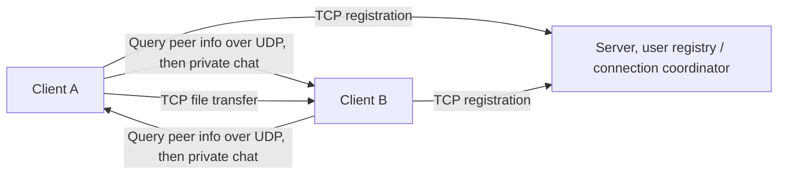

# Java Socket Chat Room Learning Project

This is a Java Socket based chat room learning project. It uses a client server architecture to tie together login, online user tracking, private chat, file transfer, heartbeat checks, and received file management. The main goal is to practice how TCP and UDP split responsibilities in network communication, so the project is positioned as a learning and demo example.

## Architecture



- The server uses fixed ports `9091` for TCP listening, `9090` for UDP receiving, and `9092` for UDP sending
- TCP handles registration, online and offline broadcasts, and heartbeat checks
- UDP handles command processing, online user lookup, private chat negotiation, and new channel setup
- File transfer starts with the receiver opening a local TCP listener, then the sender connects directly and pushes the file

## Implemented Features

- View online users
- Send private messages
- Start file transfer
- View the local list of received files
- View command hints
- Exit the client and trigger an offline broadcast
- The server uses a heartbeat thread to track client status and broadcasts updates when that status changes

## Tech Stack

| Technology / Tool | Description |
| --- | --- |
| Java 8 | The base Java version used by the project. |
| Maven | Used for dependency management and project builds. |
| `java.net.Socket` / `java.net.ServerSocket` | Used for TCP connections and server listening. |
| `java.net.DatagramSocket` | Used for UDP send and receive operations. |
| Multithreading | Used to handle concurrent server tasks and transfer flows. |
| Lombok | Used to reduce boilerplate code. |
| SLF4J + Logback | Used for unified runtime logging. |
| Fastjson | Used for data parsing and serialization. |
| Spring Core | Used to provide common utility support. |

## Transport Protocol Design

This chat room separates three kinds of communication, matching the source code's ports, command types, and handling flow. The server acts as the user registry and connection-info coordinator. It does not directly relay private chat content or file bytes.

| Communication Type | Purpose |
| --- | --- |
| TCP server connection | After login, the client registers with the server, which uses this connection to maintain the online user table and handle online and offline broadcasts plus heartbeat checks |
| UDP command exchange | The client asks the server for online users and peer connection details, then builds point to point communication with the target client based on the returned information |
| Client to client UDP / TCP transfer | Private messages travel over the client to client UDP channel, while file transfer uses the client to client TCP channel |

Before communication starts, these conditions must be met:

1. Both clients are already logged in and registered with the server.
2. The target username is online and already present in the server's `userMap`.
3. The test network must allow both IP addresses and ports to be reached, or the direct UDP or TCP connection between clients cannot be established.

Common command formats are listed below. The examples match the `ChatType` definitions in the source code.

- `username@-ol`, query online users
- `username@-pm@targetUser@message`, start a private chat
- `username@-f@targetUser@fileName`, negotiate file transfer
- `username@-nc@targetUser@message`, create a new chat channel
- `username@-sl`, let the receiver start local file listening

You can understand the private chat flow like this:

1. Client A first connects to the server over TCP and completes login and registration.
2. Client B also logs in and registers, and the server records B's connection info in the online user table.
3. Client A sends `-pm`. If there is no channel to B yet, it first sends `-nc` to ask the server for B's connection info.
4. The server returns Client B's IP and port based on the online user table.
5. After getting that information, Client A connects directly to Client B over UDP and sends the private message.

You can understand the file transfer flow like this:

1. Client A sends `-f` and first asks the server for Client B's connection info.
2. The server returns Client B's details from the online user table.
3. After receiving `-sl`, Client B starts a local TCP listener.
4. Client A uses the returned information to connect directly to Client B's TCP listening port.
5. The file bytes move directly from Client A to Client B, and the server does not relay file content.

## Core Implementation Modules

The table below maps the main classes to their responsibilities so the protocol design and code structure are easy to line up.

| Module / Class | Responsibility |
| --- | --- |
| `Server` | Server entry point. It maintains online users, coordinates TCP and UDP requests, and handles login, logout, and heartbeat checks. |
| `Client` | Client entry point. It handles login, command dispatch, private chat, file transfer negotiation, and local channel startup. |
| `Tcp` | TCP communication wrapper. It handles connection setup, message exchange, and stream based file transfer. |
| `TalkSend` | UDP sender wrapper. It sends commands and chat data to the server or other clients. |
| `TalkReceive` | UDP receiver wrapper. It listens for and parses incoming datagrams. |
| `ChatType` | Command type enum. It centralizes command keywords, examples, and menu order. |
| `User` | User info model. It stores registration data such as username, IP, and port. |
| `FileUtil` | File utility class. It creates the local receive directory, checks file existence, and reads file lists. |

## Command Reference

The project defines 9 command types:

```java
ONLINE_USERS("-ol", "online users", "-ol"), // View online users
PRIVATE_MSG("-pm", "private message", "-pm@chen@hello"), // Private message
FILE_TRANSFER("-f", "file transfer", "-f@chen@file"), // Transfer file
ACCEPTED_FILES("-af", "accepted file list", "-af"), // View received file list
EXIT("-q", "exit", "-q"), // Exit client
START_LISTEN("-sl", "start listen", "-sl"), // Start listener for receiving files
SOUT("-sout", "output", "-sout@content"), // Print attached command message
HELP("-h", "command prompt", "-h"), // Command help
NEW_CHANNEL("-nc", "New channel", "-nc@content"); // Create a new chat channel
```

### Common Commands

- `-ol`, view online users
- `-pm@chen@hello`, send a private message with the content `hello` to `chen`
- `-f@chen@file`, send the file `file` to `chen`
- `-af`, view the list of files already received in the current user's directory
- `-h`, view command hints
- `-q`, exit the client

### Protocol Commands

- `-sl`, start the file receive listener, used automatically by the file transfer flow
- `-sout@content`, print the message returned by the server
- `-nc@content`, create a new chat channel for private chat negotiation

## How to Run

1. Run a Maven build, for example `mvn clean package`
2. Start the server: `mvn exec:java -Dexec.mainClass="org.bitkernel.server.Server"`
3. Start one or more clients: `mvn exec:java -Dexec.mainClass="org.bitkernel.client.Client"`
4. If the current `pom.xml` does not yet configure the Maven Exec plugin, the `mvn exec:java` command above needs that plugin added first, or you can run the matching main class directly in your IDE
5. Each client must use different local UDP and TCP ports to avoid port conflicts
6. After logging in, start with `-h` to view the commands, then use `-ol`, `-pm@chen@hello`, `-f@chen@file`, `-af`, and `-q` as needed

## Screenshots

### Server Startup

The screen shown after running `mvn exec:java -Dexec.mainClass="org.bitkernel.server.Server"`.


### Client Login

After the client starts, enter the username, TCP listening port, and UDP send and receive ports to complete login and registration. If a port conflict occurs, enter the values again.


### View Online Users

After login, enter `-ol` to query the online user list.


### Private Chat

Sender side, enter `-pm@chen@hello` to send `hello` to `chen`.


Receiver side, the private message content is displayed.


### File Transfer

Sender side, enter `-f@chen@file` to start transferring the file `file` to `chen`.


Receiver side, the file name, file size, storage location, and elapsed time are displayed.


### View Received Files

Enter `-af` to view the list of received files in the current user's directory.


### View Command Hints

Enter `-h` to view the command hints.


### Exit

Enter `-q` to exit the client, and the server will detect the offline state through heartbeat checks.


## What I Learned

- I got a much clearer picture of how TCP and UDP split responsibilities, and it became easier to separate command exchange, connection management, and file transfer.
- I also learned more about server-side concurrency, because TCP listening, UDP handling, and heartbeat checks run independently and make the structure much clearer.
- Finally, I connected file transfer, elapsed time tracking, and local file persistence into one complete flow, which made stream based Socket programming feel more concrete.
