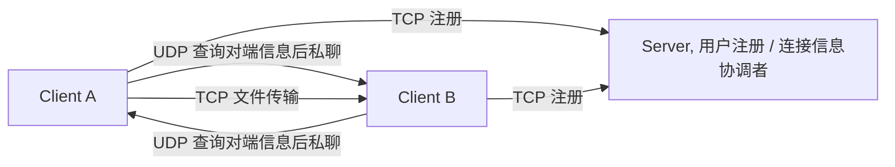

# Java Socket 聊天室学习项目

**语言：** [English](README.md) | 中文

这是一个基于 Java Socket 的聊天室学习项目，按 C/S 架构把登录、在线用户、私聊、文件传输、心跳检测和接收文件管理串在一起。重点是练习网络通信里 TCP 和 UDP 的分工方式，项目定位是学习与演示。

## 题目要求

本项目是基于 Tcp/Udp 的网络通信项目，其设计要求如下：

- 使用 Java 语言。
- 支持和指定用户聊天，用户数量不超过 100 人。
- 支持和指定用户进行文件上传和下载，支持多文件、多用户并行传输，并记录开始时间、结束时间、耗时统计和关键日志。
- 使用独立双通道机制，UDP 负责命令交互，TCP 负责文件传输，两者互不阻塞，支持开始和取消下载。
- 考虑弱网络情况，例如 UDP 丢包和 TCP 传输缓慢。

限制和实现约束如下：

- 只能使用 Java 基础 Socket 类，不使用 Netty 或其他 Socket 框架。
- TCP 使用 `java.net.Socket`。
- UDP 使用 `java.net.DatagramSocket`。
- 能检测对端离线，并打印关键的上线和下线日志。
- 本项目基本满足这些要求。

## 架构



- 服务端固定端口为 `9091`（TCP 监听）、`9090`（UDP 接收）和 `9092`（UDP 发送）
- TCP 负责注册连接、上线离线广播和心跳检测
- UDP 负责命令处理、在线用户查询、私聊协商和新通道建立
- 文件传输先由接收方开启本地 TCP 监听，再由发送方直连推送文件

## 已实现功能

- 查看在线用户
- 发送私聊消息
- 发起文件传输
- 查看本地已接收文件列表
- 查看命令提示
- 退出客户端并触发下线广播
- 服务端通过心跳线程判断客户端在线状态，并在状态变化时广播通知

## 技术栈

| 技术/工具 | 说明 |
| --- | --- |
| Java 8 | 项目使用的基础 Java 版本。 |
| Maven | 用于依赖管理和项目构建。 |
| `java.net.Socket` / `java.net.ServerSocket` | 用于 TCP 连接建立和服务监听。 |
| `java.net.DatagramSocket` | 用于 UDP 数据收发。 |
| 多线程 | 用于并发处理服务端任务和传输流程。 |
| Lombok | 用于减少样板代码。 |
| SLF4J + Logback | 用于统一记录运行日志。 |
| Fastjson | 用于数据的解析和序列化。 |
| Spring Core | 用于提供常用基础工具支持。 |

## 传输协议设计

这套聊天室把三类通信拆开处理，和源码里的端口、命令类型、处理流程是一致的。服务端是用户注册和连接信息协调者，服务端不直接转发私聊内容或文件内容。

| 通信方式 | 作用 |
| --- | --- |
| TCP 服务端连接 | 客户端登录后注册到服务端，服务端用它维护在线用户表，并做上线、离线广播和心跳检测 |
| UDP 命令交互 | 客户端向服务端查询在线用户、请求对端连接信息，再按返回结果和目标客户端建立点对点通信 |
| 客户端到客户端 UDP/TCP 传输 | 私聊走客户端之间的 UDP 通道，文件传输走客户端之间的 TCP 通道 |

开始通信前的前提条件：

1. 双方客户端都已经登录并注册到服务端。
2. 目标用户名必须在线，并且已经出现在服务端的 `userMap` 里。
3. 测试网络里双方的 IP 和端口必须可达，否则客户端之间的 UDP 或 TCP 直连无法建立。

常见命令格式如下，示例都和源码里的 `ChatType` 定义一致：

- `用户名@-ol`，查询在线用户
- `用户名@-pm@目标用户@消息`，发起私聊
- `用户名@-f@目标用户@文件名`，发起文件传输协商
- `用户名@-nc@目标用户@消息`，创建新的聊天通道
- `用户名@-sl`，让接收方启动本地文件监听

私聊流程可以按下面理解：

1. Client A 先通过 TCP 连接服务端，完成登录和注册。
2. Client B 也先登录并注册，服务端把 B 的连接信息记入在线用户表。
3. Client A 发起 `-pm`，如果本地还没有到 B 的通道，就先发 `-nc` 请求服务端提供 B 的连接信息。
4. 服务端根据在线用户表返回 Client B 的 IP 和端口信息。
5. Client A 拿到信息后，直接和 Client B 建立 UDP 通道并发送私聊内容。

文件传输流程可以按下面理解：

1. Client A 发起 `-f`，先向服务端请求 Client B 的连接信息。
2. 服务端从在线用户表里返回 Client B 的信息。
3. Client B 收到 `-sl` 后，先启动本地 TCP 监听。
4. Client A 根据返回的信息，直接连接 Client B 的 TCP 监听端口。
5. 文件字节由 Client A 直接传到 Client B，服务端不参与文件内容转发。

## 核心实现模块

下面按具体实现类梳理职责，便于把协议设计和代码结构对应起来。

| 模块/类 | 职责 |
| --- | --- |
| `Server` | 服务端入口，负责维护在线用户、协调 TCP 和 UDP 请求，并处理上线、离线和心跳检测。 |
| `Client` | 客户端入口，负责登录、命令分发、私聊、文件传输协商，以及本地通信通道的启动。 |
| `Tcp` | TCP 通信封装，负责连接建立、消息收发和文件传输中的流式读写。 |
| `TalkSend` | UDP 发送封装，负责向服务端或其他客户端发送命令和聊天数据。 |
| `TalkReceive` | UDP 接收封装，负责监听并解析收到的数据报。 |
| `ChatType` | 命令类型枚举，统一管理命令字、示例和菜单顺序。 |
| `User` | 用户信息模型，封装用户名、IP 和端口等注册信息。 |
| `FileUtil` | 文件工具类，负责本地接收目录创建、文件存在性判断和文件列表读取。 |

## 命令说明

总共包含 9 个命令：

```java
ONLINE_USERS("-ol", "online users", "-ol"), // 查看在线用户
PRIVATE_MSG("-pm", "private message", "-pm@chen@hello"), // 私信
FILE_TRANSFER("-f", "file transfer", "-f@chen@file"), // 传输文件
ACCEPTED_FILES("-af", "accepted file list", "-af"), // 获取接收文件列表
EXIT("-q", "exit", "-q"), // 退出客户端
START_LISTEN("-sl", "start listen", "-sl"), // 启动监听接收文件
SOUT("-sout", "output", "-sout@content"), // 直接输出该命令所附带的信息
HELP("-h", "command prompt", "-h"), // 命令提示
NEW_CHANNEL("-nc", "New channel", "-nc@content"); // 创建新的聊天通道
```

### 常用命令

- `-ol`，查看在线用户
- `-pm@chen@hello`，向 `chen` 发送一条内容为 `hello` 的私聊消息
- `-f@chen@file`，向 `chen` 发送文件 `file`
- `-af`，查看当前用户目录下已接收的文件列表
- `-h`，查看命令提示
- `-q`，退出客户端

### 协议命令

- `-sl`，启动文件接收监听，由文件传输流程自动使用
- `-sout@content`，输出服务端返回的提示信息
- `-nc@content`，建立新的聊天通道，用于私聊协商

## 运行方式

1. 执行 Maven 构建，例如 `mvn clean package`
2. 启动服务端：`mvn exec:java -Dexec.mainClass="org.bitkernel.server.Server"`
3. 再启动一个或多个客户端：`mvn exec:java -Dexec.mainClass="org.bitkernel.client.Client"`
4. 如果当前 `pom.xml` 还没有配置 Maven Exec 插件，上面的 `mvn exec:java` 需要先补插件，或者直接在 IDE 里运行对应的 main 类
5. 每个客户端使用不同的本地 UDP 和 TCP 端口，避免端口冲突
6. 登录后先输入 `-h` 查看命令，再按需使用 `-ol`、`-pm@chen@hello`、`-f@chen@file`、`-af`、`-q`

## 截图展示

### 服务器启动

服务端执行 `mvn exec:java -Dexec.mainClass="org.bitkernel.server.Server"` 后的启动界面。


### 客户端登录

客户端启动后输入用户名、TCP 监听端口和 UDP 收发端口，完成登录注册；端口冲突时会重新输入。


### 查看在线用户

登录后输入 `-ol` 查询在线用户列表。


### 私聊用户

发送方输入 `-pm@chen@hello`，向 `chen` 发送私聊消息 `hello`。


接收方：显示收到的私聊内容。


### 文件传输

发送方输入 `-f@chen@file`，向 `chen` 发起文件 `file` 的传输。


接收方：显示接收文件名、文件大小、存储位置和耗时。


### 查看接收文件

输入 `-af` 查看当前用户目录下已接收的文件列表。


### 查看命令提示

输入 `-h` 查看命令提示。


### 退出

输入 `-q` 退出客户端，服务器会通过心跳检测感知离线。


## 学习收获

- 我把 TCP 和 UDP 的职责边界理得更清楚了，命令交互、连接管理和文件传输各自承担的角色更容易区分。
- 我对服务端的并发组织有了更具体的认识，TCP 监听、UDP 处理和心跳检测分别独立运行，结构更清晰。
- 我也把文件传输、耗时统计和接收落盘串成了一条完整链路，对 Socket 编程里的流式读写更熟悉了。
